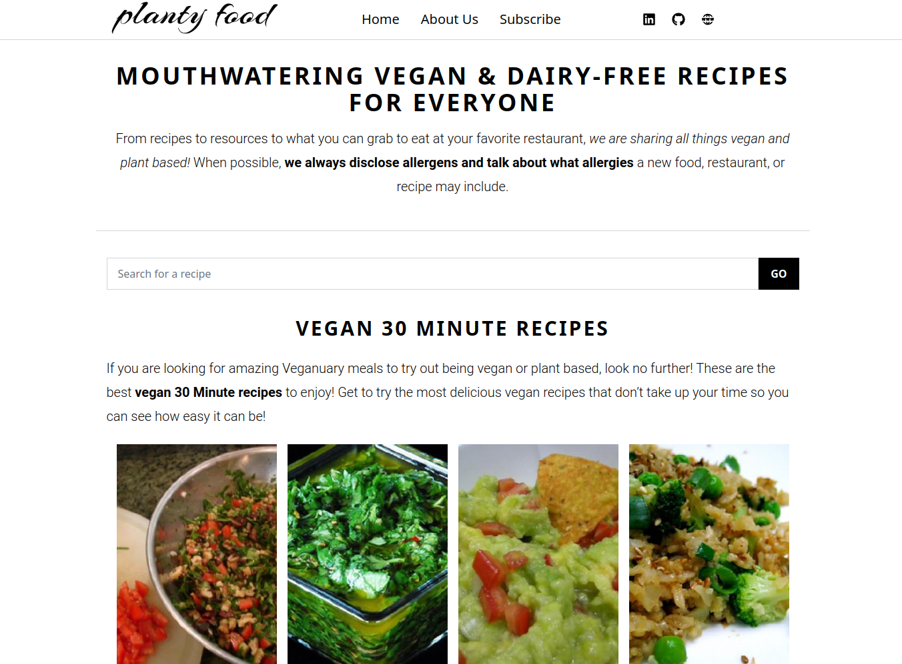
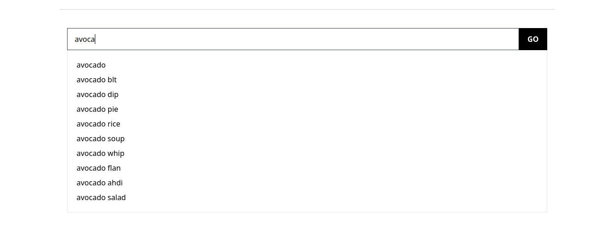
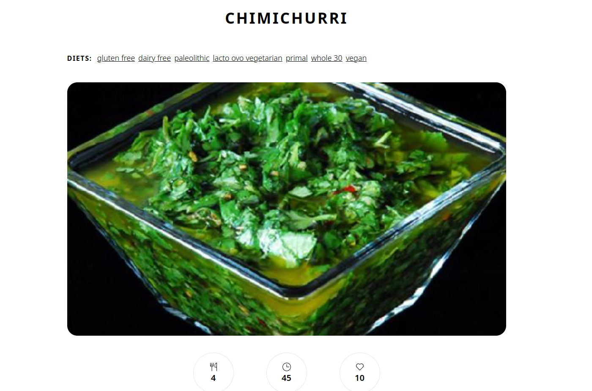

# Start2Impact React Project

- Vegetarian recipe website.
- License: MIT

Here's what the site should include:

- Search bar that allows you to search for all vegetarian recipes.
- Each recipe searched for must show at least the title and cover image.
- Click on a recipe which will take you to a dedicated page, where further information will be shown.
- Simple and easy to use UI and UX.
- Organized and understandable app structure.
- Responsive design.

## Demo

Link: https://demo4.isaccobertoli.com

## Tech Stack

- React
- Tailwind CSS
- Lodash
- Axios
- React Router DOM
- React Icons

## Screenshots

- Home

<p align="center">
    
</p>

- Search

<p align="center">
    
</p>

- Detail

<p align="center">
    
</p>

## Getting Up and Running Locally

### Clone Repo

```bash
git clone https://github.com/Isacco-B/Start2Impact_Progetto_React.git
```

### Create .env File

```bash
VITE_APIKEY = " Your spoonacular API https://spoonacular.com/food-api/console#Dashboard"
```

### Install dependencies

```bash
npm install
```

### Run development server

```bash
npm run dev
http://localhost:5173/
```

## 🔗 Links

[](https://www.linkedin.com/in/isacco-bertoli-10aa16252/)
